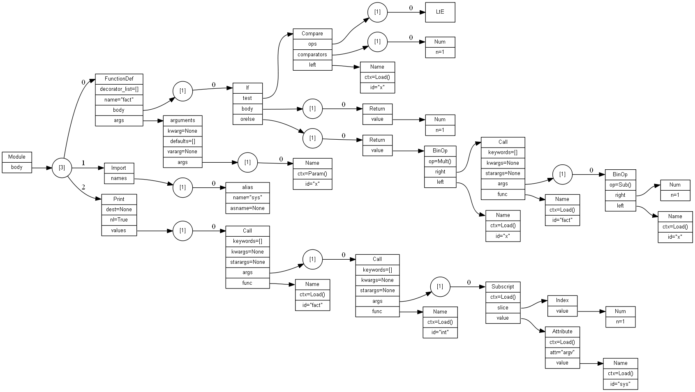

# 例

```
C:\work\ast\sample>type fact.py
def fact (x):
  if x<=1:
    return 1
  else:
    return x*fact(x-1)

import sys
print fact(int(sys.argv[1]))

C:\work\ast\sample>python ..\dump_ast_png.py fact.py
Saved dot in fact.py.dot
Saved png in fact.py.png

```

レンダリングされた AST ツリーの画像 fact.py.png を以下に示す。


